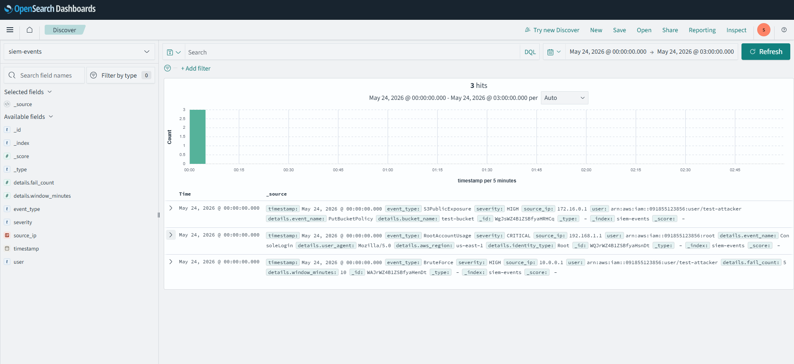

# AWS Real-Time SIEM & Threat Detection Pipeline

A serverless AWS pipeline that ingests CloudTrail-derived security events, detects high-risk activity, sends email alerts, and indexes confirmed detections in OpenSearch for investigation.

---

## Overview

This project implements a lightweight, event-driven SIEM pattern on AWS. Security-relevant API and console sign-in activity is routed through Amazon EventBridge to Python Lambda detectors. When a rule matches—or a threshold is exceeded—the pipeline publishes an SNS email alert and writes a structured document to an OpenSearch index.

**Problem it addresses:** Cloud accounts generate large volumes of audit logs. Without near-real-time filtering and alerting, risky actions such as root account usage, repeated failed console logins, or S3 ACL/policy changes can go unnoticed until a later review.

**Why real-time matters:** In cloud environments, misconfigurations and credential abuse can escalate in minutes. EventBridge-to-Lambda processing reduces the gap between an API call in CloudTrail and analyst notification, which supports faster containment and investigation.

> **Scope note:** This is a focused detection MVP—not a full enterprise SIEM. CloudTrail trails, dashboards, automated remediation, and several security hardening items are documented under [Future Improvements](#future-improvements) where they are not yet in code.

---

## Key Features

| Feature | Implementation |
|--------|----------------|
| **Event-driven ingestion** | Amazon EventBridge rules on CloudTrail event patterns |
| **Threat detection** | Three Lambda detectors (failed console auth, root usage, S3 ACL/policy changes) |
| **Threshold-based brute-force detection** | DynamoDB counter per source IP with TTL window |
| **Email alerting** | Amazon SNS topic with email subscription |
| **Event indexing** | Amazon OpenSearch (`siem-events` index) for alerts that fire |
| **Infrastructure as Code** | Terraform modules for SNS, Lambda, EventBridge, DynamoDB, and OpenSearch |
| **Encryption** | OpenSearch encryption at rest, node-to-node encryption, HTTPS enforced |
| **Operational scripts** | Parent-repo helpers for OpenSearch index setup (`../setup_opensearch.py`) and connectivity checks (`../diag.py`) |

**Not implemented in this repository:** Kinesis/Firehose log streaming, Security Hub, GuardDuty integration, OpenSearch Dashboards as code, dead-letter queues, automated blocking/remediation, or multi-account/org-wide deployment.

---

## Architecture Diagram


*Replace this placeholder with the final architecture diagram. Suggested components: CloudTrail → EventBridge → Lambda detectors → SNS + OpenSearch; DynamoDB for failed-auth state.*

---

## Architecture Explanation

Terraform (`main.tf`) provisions three modules in **us-east-1**:

| Component | AWS service | Role |
|-----------|-------------|------|
| **Ingestion** | EventBridge (CloudTrail events) | Routes matching events to the correct Lambda |
| **Detection** | Lambda (Python 3.12) | Parses event `detail`, applies rule logic, decides alert vs. skip |
| **State (brute force)** | DynamoDB (`siem-failed-auth`) | Tracks failed login counts per `source_ip` with TTL |
| **Alerting** | SNS (`guardrail-siem-alerts`) | Email notifications to the configured address |
| **Storage / search** | OpenSearch (`siem-events` domain) | Stores structured detection documents |

### Module layout (Terraform)

- **`modules/sns`** — SNS topic and email subscription
- **`modules/lambda`** — IAM role, three Lambda functions, EventBridge rules/targets/permissions, DynamoDB table
- **`modules/opensearch`** — OpenSearch domain, domain access policy, encryption settings

**Prerequisite (manual):** CloudTrail must deliver events to EventBridge. This repository does **not** create a CloudTrail trail or enable the EventBridge integration—that must exist in the target AWS account before rules will receive events.

**Circular dependency:** The Lambda module needs the OpenSearch endpoint; the OpenSearch module needs the Lambda role ARN for its access policy. Terraform resolves this through cross-module references on apply.

---

## Event Processing Flow

1. **CloudTrail** records an API or console sign-in event in the AWS account.
2. **EventBridge** evaluates one or more rules (`siem-failed-auth-detection`, `siem-root-account-usage`, `siem-s3-public-exposure`) and invokes the target Lambda when the pattern matches.
3. **Lambda** reads `event.detail` (CloudTrail payload shape).
4. **Rule logic** runs:
   - *Failed auth:* skip unless `errorMessage` contains `Failed authentication`; increment DynamoDB counter; alert only if count ≥ threshold.
   - *Root usage:* skip unless `userIdentity.type` is `Root`; alert immediately.
   - *S3 exposure:* alert on every matching `PutBucketAcl` / `PutBucketPolicy` (no post-check that the bucket is actually public).
5. **SNS** publishes an email (when an alert fires).
6. **OpenSearch** receives a JSON document via HTTPS (`POST /siem-events/_doc`) using basic authentication from Lambda environment variables.
7. **DynamoDB TTL** expires brute-force counter rows after the configured window.

---

## Threat Detection Logic

Detection logic lives in `lambda_functions/*/handler.py`. Rules are intentionally simple and should be tuned before any production use.

### 1. Brute force — failed console authentication

| Attribute | Value |
|-----------|--------|
| **Lambda** | `siem-failed-auth-detector` |
| **EventBridge** | `aws.signin` / `AWS Console Sign In via CloudTrail` |
| **Detects** | Repeated failed AWS Management Console sign-in attempts from the same source IP |
| **Threshold** | `5` failures (env `FAILURE_THRESHOLD`) |
| **Window** | `600` seconds / 10 minutes (env `WINDOW_SECONDS`, DynamoDB TTL) |
| **Severity** | `HIGH` (indexed document only when alert fires) |
| **Alert subject** | `[SIEM ALERT] Brute Force Detected from {source_ip}` |

Intermediate failures are recorded in DynamoDB only; SNS and OpenSearch are updated when the threshold is reached.

### 2. Root account usage

| Attribute | Value |
|-----------|--------|
| **Lambda** | `siem-root-usage-detector` |
| **EventBridge** | Multiple sources (`aws.signin`, `aws.iam`, `aws.s3`, `aws.ec2`, `aws.cloudtrail`) with `userIdentity.type = Root` |
| **Detects** | Any CloudTrail event where the principal is the root account |
| **Threshold** | None — one event triggers an alert |
| **Severity** | `CRITICAL` |
| **Alert subject** | `[CRITICAL SIEM ALERT] Root Account Usage Detected` |

### 3. S3 public exposure (policy / ACL change)

| Attribute | Value |
|-----------|--------|
| **Lambda** | `siem-s3-exposure-detector` |
| **EventBridge** | `aws.s3` / `AWS API Call via CloudTrail` for `PutBucketAcl`, `PutBucketPolicy` |
| **Detects** | S3 bucket ACL or bucket policy modification events |
| **Threshold** | None — each matching API call triggers an alert |
| **Severity** | `HIGH` |
| **Alert subject** | `[SIEM ALERT] S3 Public Exposure Detected` |

> **Honest limitation:** The handler does not parse the new ACL or policy to confirm public access. Any qualifying API call generates an alert. Reducing false positives would require additional logic (e.g., inspect `requestParameters` / policy JSON).

### Indexed document schema (OpenSearch)

Fields written by detectors:

- `timestamp`, `event_type`, `severity`, `source_ip`, `user`, `details` (object)

The index mapping is defined in `../setup_opensearch.py` (parent directory), not in Terraform.

---

## Tech Stack

| Category | Technologies |
|----------|----------------|
| **Language** | Python 3.12 (Lambda handlers) |
| **IaC** | Terraform (HashiCorp AWS provider ~6.45, archive provider ~2.8) |
| **AWS services** | EventBridge, Lambda, SNS, DynamoDB, OpenSearch Service, IAM, CloudWatch Logs (via Lambda execution) |
| **Libraries (Lambda)** | `boto3`, `urllib3` (OpenSearch HTTP) |
| **Libraries (setup scripts)** | `boto3`, `requests`, `requests-aws4auth`, `certifi` (parent repo `venv`) |
| **Tooling** | AWS CLI, Terraform ≥ 1.x |

No Node.js, Docker, or container images are used for the pipeline itself.

---

## Repository Structure

```
cloud-siem-pipeline/
├── main.tf                      # Root module: wires sns, lambda, opensearch
├── variables.tf                 # Root input variables
├── outputs.tf                   # OpenSearch endpoint/ARN, SNS topic ARN
├── terraform.tfvars.example     # Example variable values (copy to terraform.tfvars)
├── README.md
├── payload.json                 # Sample EventBridge payload (local testing; gitignored)
├── response.json                # Lambda invoke output (gitignored)
├── lambda_functions/
│   ├── failed_auth/handler.py   # Brute-force detector
│   ├── root_usage/handler.py    # Root account detector
│   └── s3_exposure/handler.py   # S3 ACL/policy change detector
└── modules/
    ├── lambda/                  # Lambdas, EventBridge, DynamoDB, IAM
    ├── opensearch/              # OpenSearch domain and access policy
    └── sns/                     # Alert topic and email subscription

../setup_opensearch.py            # Post-deploy: index mapping, role mapping, test doc
../diag.py                        # Connectivity / credential sanity check
```

Generated at build/apply time (gitignored): `*.zip` Lambda packages, `.terraform/`, `terraform.tfstate*`.

---

## Infrastructure as Code

### Root variables

| Variable | Description | Sensitive |
|----------|-------------|-----------|
| `alert_email` | SNS email subscription endpoint | No |
| `opensearch_master_user` | OpenSearch fine-grained access master user | No |
| `opensearch_master_password` | OpenSearch master password | Yes |

### Root outputs

| Output | Description |
|--------|-------------|
| `opensearch_endpoint` | HTTPS endpoint for the domain |
| `opensearch_arn` | Domain ARN |
| `sns_topic_arn` | Topic for SIEM alerts |

### Major provisioned resources

- **SNS:** `guardrail-siem-alerts` + email subscription
- **Lambda:** `siem-failed-auth-detector`, `siem-root-usage-detector`, `siem-s3-exposure-detector`
- **EventBridge:** Three rules with Lambda targets and invoke permissions
- **DynamoDB:** `siem-failed-auth` (pay-per-request, hash key `source_ip`, TTL on `ttl`)
- **IAM:** `siem-lambda-exec-role` with SNS publish, CloudWatch Logs, and DynamoDB access
- **OpenSearch:** `siem-events` domain (single `t3.small.search`, 10 GB gp3 EBS)

### Environments

There is a **single** Terraform configuration—no `dev`/`prod` workspace split or environment-specific `.tfvars` files beyond your local `terraform.tfvars`.

---

## Security Considerations

### Implemented

- **OpenSearch encryption:** at-rest and node-to-node encryption enabled; HTTPS enforced with TLS 1.2+ policy
- **Fine-grained access control:** OpenSearch advanced security with internal master user
- **Domain access policy:** Allows the Lambda execution role; includes IP-restricted and IAM-user statements (see gaps below)
- **Audit trail dependency:** Detections rely on CloudTrail (account-level audit source)
- **DynamoDB TTL:** Limits retention of brute-force counter state
- **Secrets in Terraform:** `opensearch_master_password` marked `sensitive`; `terraform.tfvars` gitignored

### Gaps and risks (address before production)

| Area | Current state |
|------|----------------|
| **IAM least privilege** | Lambda policy uses `Resource = "*"` for SNS and CloudWatch Logs; DynamoDB ARN includes a **hardcoded account ID** (`091855123856`) |
| **OpenSearch credentials** | Master username/password passed as **plain Lambda environment variables** (visible to anyone with `lambda:GetFunctionConfiguration`) |
| **OpenSearch access policy** | Contains hardcoded IAM user ARN and **single /32 public IP**; a broad `Principal: *` with IP condition—must be updated for your environment |
| **S3 rule accuracy** | Alerts on API name only, not verified public exposure |
| **Secrets management** | No AWS Secrets Manager / SSM Parameter Store integration |
| **Network isolation** | OpenSearch is not VPC-attached in Terraform |
| **DLQ / failed invocations** | No dead-letter queue or Lambda failure alarms |
| **Setup script** | `../setup_opensearch.py` contains hardcoded endpoint and credentials—treat as a one-off bootstrap, not a secure pattern |

Items above belong in hardening work unless noted in [Future Improvements](#future-improvements).

---

## Monitoring and Observability

| Mechanism | What you can monitor |
|-----------|----------------------|
| **CloudWatch Logs** | Lambda execution logs (automatic log groups per function) |
| **Lambda metrics** | Invocations, errors, duration, throttles (CloudWatch default) |
| **SNS** | Email delivery of alert subjects and bodies |
| **OpenSearch** | Document count and contents in `siem-events` (e.g., `_count`, Discover if enabled) |
| **DynamoDB** | Item counts per `source_ip` for active brute-force tracking |

**Not in repo:** CloudWatch dashboards, alarms on Lambda errors, SNS delivery failure monitoring, or OpenSearch slow-log/index alarms.

---

## Setup and Deployment

### Prerequisites

1. **AWS account** with permissions to create Lambda, EventBridge, SNS, DynamoDB, OpenSearch, and IAM resources
2. **AWS CLI** configured (`aws configure` or equivalent credentials)
3. **Terraform** ≥ 1.0
4. **CloudTrail** enabled with **EventBridge integration** (trail must send events to the default event bus)
5. **SNS email confirmation** — after deploy, confirm the subscription email from AWS
6. **Python 3** (optional, for parent-repo setup/diagnostic scripts)

### 1. Configure variables

```bash
cd cloud-siem-pipeline
cp terraform.tfvars.example terraform.tfvars
```

Edit `terraform.tfvars` with your alert email and strong OpenSearch master password. Do not commit this file.

### 2. Deploy infrastructure

```bash
terraform init
terraform plan
terraform apply
```

Note the outputs: `opensearch_endpoint`, `sns_topic_arn`.

### 3. Confirm SNS subscription

Check the inbox for `alert_email` and confirm the AWS SNS subscription.

### 4. Initialize OpenSearch index (manual)

Terraform creates the domain but not the `siem-events` index mapping. Use the parent script after updating endpoint and credentials:

```bash
cd ..
# Edit setup_opensearch.py: endpoint, credentials, IAM ARNs for your account
python setup_opensearch.py
```

Alternatively, create the index via OpenSearch Dashboards or the REST API using the mapping in that script.

### 5. Update hardcoded Terraform values

Before sharing or reusing in another account, update:

- `modules/opensearch/main.tf` — IAM user ARN, IP allow list
- `modules/lambda/main.tf` — DynamoDB table ARN account ID

### 6. Verify CloudTrail → EventBridge

Ensure your trail is active and EventBridge delivery is enabled. Without this, rules will never invoke Lambdas.

---

## Configuration

### Terraform variables (root)

| Name | Required | Default | Purpose |
|------|----------|---------|---------|
| `alert_email` | Yes | — | SNS email recipient |
| `opensearch_master_user` | Yes | — | OpenSearch master user |
| `opensearch_master_password` | Yes | — | OpenSearch master password |

### Lambda environment variables (set in Terraform)

| Function | Variable | Value / notes |
|----------|----------|----------------|
| All detectors | `SNS_TOPIC_ARN` | From SNS module |
| All detectors | `OPENSEARCH_ENDPOINT` | Domain endpoint (no `https://` prefix) |
| All detectors | `OPENSEARCH_USER` / `OPENSEARCH_PASS` | Master credentials |
| Failed auth | `DYNAMODB_TABLE` | `siem-failed-auth` |
| Failed auth | `FAILURE_THRESHOLD` | `5` |
| Failed auth | `WINDOW_SECONDS` | `600` |

### Region

Provider region is fixed to **`us-east-1`** in `main.tf`. Change the provider and any hardcoded ARNs if deploying elsewhere.

---

## Testing

There is **no automated test suite** (no `tests/` directory, pytest, or CI).

### Manual Lambda invoke (brute force)

Use `payload.json` or inline JSON matching EventBridge’s CloudTrail `detail` shape:

```bash
# Invoke once — expect status "recorded" until threshold
aws lambda invoke \
  --function-name siem-failed-auth-detector \
  --payload file://payload.json \
  response.json

cat response.json
```

Simulate threshold breach (5 invocations with same `sourceIPAddress`):

```bash
for i in 1 2 3 4 5; do
  aws lambda invoke \
    --function-name siem-failed-auth-detector \
    --payload '{"detail":{"errorMessage":"Failed authentication","sourceIPAddress":"10.0.0.99","eventTime":"2026-05-23T10:00:00Z","userIdentity":{"arn":"arn:aws:iam::ACCOUNT_ID:user/test-attacker"}}}' \
    response.json
  cat response.json
done
```

Replace `ACCOUNT_ID` with your AWS account ID. On the fifth call, expect `"status": "alert_sent"` and an SNS email.

> **CLI note:** Older AWS CLI v1 may not support `--cli-binary-format raw-in-base64-out`; use `file://payload.json` or upgrade to AWS CLI v2.

### Other detectors

- **Root:** Invoke `siem-root-usage-detector` with a synthetic event where `detail.userIdentity.type` is `Root`.
- **S3:** Invoke `siem-s3-exposure-detector` with `detail.eventName` set to `PutBucketPolicy` and appropriate `requestParameters.bucketName`.

### Suggested future testing

- Unit tests for handler parsing and threshold logic
- Terraform `validate` / `plan` in CI
- EventBridge sample events from AWS documentation as fixtures
- Integration tests in a disposable AWS account

---

## Example Alerts / Screenshots




---

## Challenges and Lessons Learned

- **CloudTrail is the real source of truth** — EventBridge rules are useless without a correctly configured trail and EventBridge integration; this coupling is easy to overlook in IaC-only repos.
- **False positives vs. speed** — The S3 detector favors fast notification over accuracy; production SIEMs usually add policy parsing or post-event verification.
- **Stateful detection in serverless** — Brute-force counting with DynamoDB and TTL is simple and cost-effective but is per-account and per-IP only (no username dimension in the key).
- **Credential handling** — Passing OpenSearch master credentials into Lambda environment variables is convenient for an MVP but conflicts with least-privilege and rotation practices; IAM signing or data-plane roles are the usual upgrade path.
- **Module interdependencies** — OpenSearch needs the Lambda role ARN while Lambda needs the endpoint; plan applies carefully and document bootstrap order for teammates.
- **Alert noise** — Root and S3 rules alert on first match; failed auth waits for a threshold—tune thresholds and consider suppression windows as traffic grows.
- **Hardcoded account artifacts** — ARNs and IP allow lists in Terraform reduce portability; parameterize early when moving accounts.

---

## Cost Considerations

| Service | Cost driver |
|---------|-------------|
| **OpenSearch** | Largest steady-state cost: `t3.small.search` instance + 10 GB EBS (24/7) |
| **Lambda** | Per-invocation; low at moderate EventBridge volume |
| **DynamoDB** | On-demand pricing; small items with TTL expiry |
| **SNS** | Email notifications (low volume) |
| **EventBridge** | Custom events / invocations (typically low for security rules) |
| **CloudTrail** | Management events (first trail often free tier; data events extra) |

**Serverless benefits:** Lambda and DynamoDB scale to zero idle cost for compute; OpenSearch does not.

**Optimization ideas (not implemented):** OpenSearch UltraWarm/cold storage, smaller instance for dev, index lifecycle policies, shorten CloudTrail retention if duplicated elsewhere, replace email with cheaper channels for high-volume tests.

---

## Future Improvements

- [ ] **Multi-account / Organizations** — centralized logging account, delegated EventBridge
- [ ] **CloudTrail as code** — Terraform module for trail, S3 bucket, and EventBridge enablement
- [ ] **Sigma / structured rule engine** — portable detection content
- [ ] **Threat intelligence** — IP/domain reputation enrichment on alerts
- [ ] **Anomaly detection** — baselines for API volume and geo
- [ ] **SOAR / remediation** — WAF IP block, Security Group deny, SSM automation
- [ ] **OpenSearch Dashboards** — saved searches and detection overview (IaC or export)
- [ ] **CI/CD** — `terraform fmt/validate/plan`, Python lint/test on pull requests
- [ ] **Test coverage** — unit and integration tests for all three handlers
- [ ] **Security hardening** — Secrets Manager, VPC OpenSearch, least-privilege IAM, DLQ, Lambda error alarms
- [ ] **S3 detection accuracy** — evaluate policy/ACL for public access before alerting
- [ ] **Parameterize** — remove hardcoded account ID, IAM user, and IP from OpenSearch policy
- [ ] **License file** — add explicit open-source license

---

## License

License to be added.

---

## Author

<!-- TODO: Replace placeholders with your links -->

| | |
|---|---|
| **GitHub** | [@Dfortune014](https://github.com/Dfortune014) |
| **LinkedIn** | [Fortune Linus](https://www.linkedin.com/in/fortunelinus/) |
| **Portfolio** | [fortunelinus.com](https://your-portfolio.example) |

---

## Post-README checklist (for maintainers)

1. Add `docs/images/architecture-diagram.png` and screenshot placeholders.
2. Replace hardcoded ARNs/IPs in `modules/opensearch/main.tf` and `modules/lambda/main.tf`.
3. Parameterize or remove credentials from `../setup_opensearch.py`.
4. Confirm CloudTrail → EventBridge in the target account.
5. Add a `LICENSE` file when ready.
