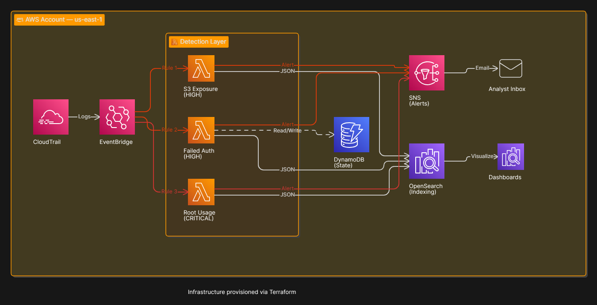
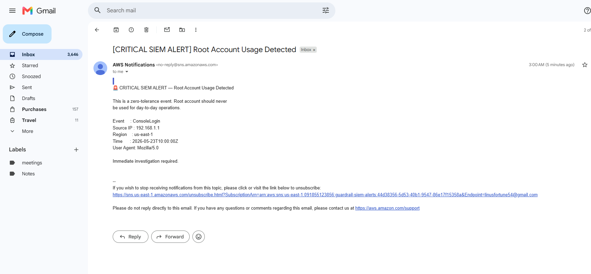

# AWS Real-Time SIEM & Threat Detection Pipeline

An AWS-native, event-driven security pipeline that ingests CloudTrail-derived events via EventBridge, runs serverless detection logic, sends email alerts through SNS, and indexes confirmed detections in Amazon OpenSearch for investigation.

> **Maturity:** This repository implements a focused detection MVP. It is **not** production-ready as-is. Several prerequisites (CloudTrail → EventBridge), bootstrap steps (OpenSearch index), and security hardening items are documented explicitly below.

---

## Overview

This project demonstrates how to build a lightweight SIEM-style detection pipeline entirely on managed AWS services. Security-relevant activity—failed console sign-ins, root account API usage, and S3 ACL/policy changes—is evaluated in near real time without operating long-lived servers.

**Security problem:** Cloud audit logs are high-volume and easy to defer. High-impact events (root usage, credential stuffing against the console, risky S3 changes) need fast triage, not only periodic log review.

**Why real-time matters:** Cloud compromise and misconfiguration timelines are measured in minutes. Routing CloudTrail events through EventBridge to Lambda reduces detection latency compared to batch log analysis, supporting faster investigation and containment.

---

## Why This Project Matters

Cloud environments are API-driven and highly automated. A single misconfigured S3 policy or exposed root credentials can affect the entire account before a weekly log review occurs.

Automated detection pipelines translate audit telemetry into **actionable signals**: structured alerts, indexed events, and repeatable infrastructure. AWS-native patterns (EventBridge, Lambda, DynamoDB, OpenSearch) show how security operations can align with modern cloud architecture—elastic, pay-per-use, and defined as code.

This project is suitable as a portfolio piece for **cloud security**, **detection engineering**, and **infrastructure-as-code** practice: it connects threat models to concrete event patterns and implementation tradeoffs.

---

## Engineering Goals

| Goal | How the project addresses it |
|------|------------------------------|
| **Serverless security architecture** | No EC2 or container fleet; compute is Lambda-only |
| **Event-driven processing** | EventBridge rules invoke detectors on matching CloudTrail events |
| **Detection engineering** | Three explicit rules with severities, thresholds, and documented limitations |
| **Terraform / IaC** | Modular Terraform for SNS, Lambda, EventBridge, DynamoDB, OpenSearch |
| **Observability (baseline)** | CloudWatch Logs via Lambda; SNS for human-visible alerts |
| **AWS-native SIEM concepts** | Ingest → detect → alert → index, using account audit and search services |
| **Security-focused design** | Encryption on OpenSearch, IAM SigV4 to OpenSearch, DynamoDB TTL for state |

---

## Key Features

- **EventBridge ingestion** — Three rules targeting CloudTrail event shapes (`aws.signin`, `aws.s3`, multi-service root activity)
- **Lambda-based detections** — Python 3.12 functions: `siem-failed-auth-detector`, `siem-root-usage-detector`, `siem-s3-exposure-detector`
- **SNS email alerting** — Topic `guardrail-siem-alerts` with email subscription
- **OpenSearch indexing** — Documents written to `siem-events` via **IAM SigV4** (`botocore` signing)
- **DynamoDB threshold tracking** — Table `siem-failed-auth` with per-IP counters and TTL
- **Terraform deployment** — Root module + `sns`, `lambda`, `opensearch` child modules
- **OpenSearch encryption** — At-rest, node-to-node, HTTPS/TLS 1.2+ enforced
- **Fine-grained access control** — OpenSearch advanced security with internal master user (domain admin / bootstrap)
- **CloudWatch logging** — Standard Lambda log groups (implicit; not customized in Terraform)
- **Lambda timeout** — 30 seconds per function

**Not implemented:** GuardDuty, Security Hub, Kinesis/Firehose, SOAR, dashboards as code, DLQs, multi-account aggregation, automated remediation, CI/CD, automated tests.

---

## Detection Coverage

| Detection | Severity | Alerting | Indexed | Stateful |
|-----------|----------|----------|---------|----------|
| **Brute force (failed console auth)** | HIGH | Yes, when ≥ 5 failures in window | Yes, on alert only | Yes — DynamoDB per `source_ip` |
| **Root account usage** | CRITICAL | Yes, every match | Yes, every alert | No |
| **S3 ACL / policy change** | HIGH | Yes, every match | Yes, every alert | No |

---

## Architecture Diagram



TODO: Replace with final architecture diagram.

---

## Architecture Explanation

### High-level flow

```
CloudTrail → (default) EventBridge bus → EventBridge rules → Lambda detectors
                                                      ├→ SNS (email)
                                                      ├→ DynamoDB (failed auth only)
                                                      └→ OpenSearch (siem-events index)
```

### AWS services and rationale

| Service | Role | Why it was chosen |
|---------|------|-------------------|
| **CloudTrail** | Source of truth for API / console events | Required for AWS API audit; EventBridge integration enables real-time routing |
| **EventBridge** | Filter and route events | Decouples ingestion from detection; pattern matching without polling S3 log buckets |
| **Lambda** | Detection runtime | Scales per event, minimal ops overhead, fits bursty security traffic |
| **DynamoDB** | Brute-force counter + TTL | Low-latency keyed state (`source_ip`) without managing Redis/EC2 |
| **SNS** | Alert notification | Simple email channel for MVP; no third-party integration required |
| **OpenSearch Service** | Detection storage / search | Structured fields for investigation; familiar SIEM query UX |
| **IAM** | Lambda execution + OpenSearch HTTP | SigV4 signing from Lambda role; domain policy grants `es:*` to role |

### Terraform modules

| Module | Provisions |
|--------|------------|
| `modules/sns` | SNS topic + email subscription |
| `modules/lambda` | IAM role/policy, 3× Lambda, 3× EventBridge rules/targets/permissions, DynamoDB table |
| `modules/opensearch` | OpenSearch domain `siem-events`, domain access policy |

**Root wiring (`main.tf`):** `module.sns` → `module.opensearch` ↔ `module.lambda` (OpenSearch needs `lambda_role_arn`; Lambda needs `opensearch_endpoint`). Terraform resolves this circular reference on apply.

### Tradeoffs

- **Pros:** Low operational burden, fast path from event to alert, reproducible infra, pay-per-use components.
- **Cons:** Per-rule Lambda (not a shared rules engine), no centralized correlation, OpenSearch is a fixed-cost anchor, detection logic is code-not-data (no Sigma/YAML rules).

### Scalability (current)

- Lambda and EventBridge scale with event volume in a single account.
- OpenSearch is a **single** `t3.small.search` node—vertical scaling or cluster redesign needed at higher ingest rates.
- Failed-auth state is **per source IP** only; high cardinality of IPs could increase DynamoDB item count (mitigated somewhat by TTL).

---

## Security Architecture Decisions

| Decision | Rationale (as implemented) |
|----------|----------------------------|
| **Serverless detectors** | No persistent compute to patch; blast radius limited to function IAM and env vars |
| **EventBridge decoupling** | Ingestion patterns can change without redeploying Lambda code (within pattern limits) |
| **DynamoDB + TTL** | Brute-force state expires automatically (`WINDOW_SECONDS`); avoids indefinite IP tracking |
| **Threshold before alert (failed auth)** | Reduces alert noise vs. alerting on every failed login |
| **Immediate alert (root, S3)** | High-severity or high-risk changes warrant instant notification in this MVP |
| **OpenSearch encryption** | Protects indexed detection data at rest and in transit |
| **IAM SigV4 to OpenSearch** | Lambdas use execution role credentials (`SigV4Auth`) instead of static passwords in environment variables |
| **Terraform-managed domain** | Reproducible encryption, HTTPS, and access policy baseline |
| **Single shared Lambda role** | Simpler IAM for MVP; all detectors share `siem-lambda-exec-role` |

---

## Event Processing Flow

1. **Event generation** — An API call or console sign-in occurs; CloudTrail records it (trail must exist and, for EventBridge delivery, integration must be enabled).
2. **EventBridge routing** — A rule (`siem-failed-auth-detection`, `siem-root-account-usage`, or `siem-s3-public-exposure`) matches the event pattern and invokes the target Lambda.
3. **Lambda processing** — Handler parses `event["detail"]` (CloudTrail payload).
4. **Detection logic** — Rule-specific filters (error message, `userIdentity.type`, `eventName`) and, for failed auth, DynamoDB counter vs. threshold.
5. **Alerting** — On alert path, `sns.publish()` sends email to subscribed addresses.
6. **Indexing** — On alert path (and threshold met for brute force), `POST https://{endpoint}/siem-events/_doc` with SigV4-signed request.
7. **Investigation** — Analyst reviews SNS email and queries OpenSearch (`siem-events`) via Dashboards or REST API. **Dashboards are not provisioned in this repo.**

---

## Threat Detection Logic

### 1. Brute force — failed console authentication

| Item | Detail |
|------|--------|
| **Lambda** | `siem-failed-auth-detector` |
| **EventBridge** | Source `aws.signin`, detail-type `AWS Console Sign In via CloudTrail` |
| **Logic** | Skip unless `detail.errorMessage` contains `Failed authentication` |
| **Threshold** | `5` failures (`FAILURE_THRESHOLD`) |
| **Window** | `600` seconds (`WINDOW_SECONDS`); DynamoDB TTL on attribute `ttl` |
| **Severity** | `HIGH` (in indexed document) |
| **False positives** | Shared NAT IPs, security scanners, legitimate users mistyping passwords |
| **Limitations** | Keyed by IP only (not username); no geo/block automation; sub-threshold events are not indexed |

### 2. Root account usage

| Item | Detail |
|------|--------|
| **Lambda** | `siem-root-usage-detector` |
| **EventBridge** | Sources include `aws.signin`, `aws.iam`, `aws.s3`, `aws.ec2`, `aws.cloudtrail`; `userIdentity.type` = `Root` |
| **Logic** | Lambda double-checks `identity_type == "Root"` |
| **Threshold** | None — one event → alert + index |
| **Severity** | `CRITICAL` |
| **False positives** | Rare if root is unused; break-glass root access triggers by design |
| **Limitations** | Does not distinguish read vs. write; no approval workflow |

### 3. S3 “public exposure” (ACL / policy change)

| Item | Detail |
|------|--------|
| **Lambda** | `siem-s3-exposure-detector` |
| **EventBridge** | Source `aws.s3`, `eventName` ∈ `PutBucketAcl`, `PutBucketPolicy` |
| **Logic** | Alerts on API name match only |
| **Threshold** | None |
| **Severity** | `HIGH` |
| **False positives** | **High** — any policy/ACL update alerts; does not parse JSON for `Principal: "*"` or public ACL grants |
| **Limitations** | Name is aspirational; verification of public access is **not implemented** |

### Indexed document shape

```json
{
  "timestamp": "<ISO8601>",
  "event_type": "BruteForce | RootAccountUsage | S3PublicExposure",
  "severity": "HIGH | CRITICAL",
  "source_ip": "<ip>",
  "user": "<arn or identity>",
  "details": { }
}
```

Index mapping is created manually via `../setup_opensearch.py` (parent repo), not Terraform.

---

## Scalability Considerations

| Component | Current behavior | Future considerations |
|-----------|------------------|----------------------|
| **Lambda** | Concurrent executions scale with invocations; 30s timeout | Reserved concurrency per detector; provisioned concurrency if cold start matters |
| **EventBridge** | Default bus limits apply; pattern volume per account | Organization-wide buses, cross-account forwarding |
| **DynamoDB** | On-demand (`PAY_PER_REQUEST`), single partition key `source_ip` | Hot keys if one IP dominates; consider composite key (IP + user) |
| **OpenSearch** | 1× `t3.small.search`, 10 GB gp3 | Multi-AZ, dedicated masters, UltraWarm/ILM for retention |
| **SNS email** | Human-scale alert volume | SQS fan-out, ticketing webhooks, rate limiting |

At very high CloudTrail volume, broad rules (e.g. all console sign-ins for failed-auth) can invoke Lambda frequently—cost and throttling should be monitored.

---

## Tech Stack

| Category | Technologies |
|----------|----------------|
| **Languages** | Python 3.12 (Lambda) |
| **AWS services** | CloudTrail (prerequisite), EventBridge, Lambda, SNS, DynamoDB, OpenSearch Service, IAM, CloudWatch Logs |
| **IaC** | Terraform; providers: `hashicorp/aws` ~6.45, `hashicorp/archive` ~2.8 |
| **Libraries (Lambda)** | `boto3`, `botocore` (SigV4), `urllib3` |
| **Libraries (bootstrap scripts)** | `boto3`, `requests`, `requests-aws4auth`, `certifi` (parent `venv`) |
| **Monitoring** | CloudWatch (Lambda default metrics/logs only) |
| **Deployment** | Terraform CLI, AWS CLI |

---

## Repository Structure

```
cloud-siem-pipeline/
├── main.tf                      # Provider, module orchestration
├── variables.tf                 # alert_email, OpenSearch master credentials
├── outputs.tf                   # opensearch_endpoint, opensearch_arn, sns_topic_arn
├── terraform.tfvars.example     # Example inputs (copy → terraform.tfvars)
├── README.md
├── payload.json                 # Sample invoke payload (gitignored)
├── response.json                # Invoke output (gitignored)
├── docs/
│   └── images/                  # Architecture diagram, screenshots (add locally)
├── lambda_functions/
│   ├── failed_auth/handler.py
│   ├── root_usage/handler.py
│   └── s3_exposure/handler.py
└── modules/
    ├── lambda/                  # Detectors, EventBridge, DynamoDB, IAM
    ├── opensearch/              # Domain + access policy
    └── sns/                     # Alert topic

../setup_opensearch.py           # Post-deploy: index + FGAC role mapping (parent repo)
../diag.py                       # Ad-hoc connectivity check (parent repo)
```

---

## Infrastructure as Code

### Layout

- **Single environment** — No `dev`/`prod` workspaces or separate state backends defined in repo.
- **State** — Local `terraform.tfstate` (gitignored); **remote state not configured**.
- **Region** — `us-east-1` hardcoded in provider and several ARNs.

### Root variables

| Variable | Purpose | Sensitive |
|----------|---------|-----------|
| `alert_email` | SNS email endpoint | No |
| `opensearch_master_user` | OpenSearch fine-grained master user | No |
| `opensearch_master_password` | OpenSearch master password | Yes |

### Root outputs

| Output | Description |
|--------|-------------|
| `opensearch_endpoint` | Domain hostname for HTTPS API |
| `opensearch_arn` | Domain ARN |
| `sns_topic_arn` | Alert topic ARN |

### Resources provisioned (summary)

- SNS topic `guardrail-siem-alerts` + email subscription
- IAM role `siem-lambda-exec-role` + inline policy (SNS, Logs, DynamoDB `siem-*`, OpenSearch HTTP)
- 3× Lambda functions, 3× EventBridge rules, targets, invoke permissions
- DynamoDB `siem-failed-auth` (TTL enabled)
- OpenSearch domain `siem-events` (OpenSearch 2.11, `t3.small.search`)

### Deployment flow

```bash
cd cloud-siem-pipeline
cp terraform.tfvars.example terraform.tfvars
# Edit terraform.tfvars (do not commit)

terraform init
terraform plan
terraform apply
```

**Note:** `main.tf` passes `opensearch_user` / `opensearch_pass` into the Lambda module, but the module **does not use them** in resources (legacy variables). OpenSearch access from Lambda is via **IAM SigV4** only.

---

## Security Considerations

### Implemented Security Controls

| Control | Implementation |
|---------|----------------|
| **IAM** | Dedicated Lambda execution role; OpenSearch HTTP actions scoped to `domain/siem-events/*` |
| **OpenSearch signing** | Lambdas use `SigV4Auth` with execution role credentials |
| **Encryption** | OpenSearch encrypt at rest + node-to-node; HTTPS enforced |
| **TLS** | `Policy-Min-TLS-1-2-2019-07` on domain endpoint |
| **Access policy** | Domain policy allows Lambda role; additional principals in policy (see gaps) |
| **Audit dependency** | Detections require CloudTrail |
| **TTL cleanup** | DynamoDB TTL on brute-force tracking rows |
| **Secrets in Terraform** | `opensearch_master_password` marked `sensitive`; `terraform.tfvars` gitignored |
| **Logging** | Lambda → CloudWatch Logs (AWS-managed) |

### Security Gaps / Risks

| Risk | Detail |
|------|--------|
| **Hardcoded account ID** | DynamoDB and OpenSearch IAM resources use `091855123856` |
| **Hardcoded IAM user** | `arn:aws:iam::091855123856:user/siem-project-user` in OpenSearch domain policy |
| **Hardcoded IP allow list** | `68.35.124.19/32` with `Principal: "*"` in domain policy |
| **Broad IAM statements** | SNS and CloudWatch Logs use `Resource = "*"` |
| **Broad OpenSearch domain policy** | `es:*` for Lambda role and IAM user |
| **No Secrets Manager** | Master password in `terraform.tfvars` only |
| **No VPC** | OpenSearch not VPC-attached in Terraform |
| **No DLQ** | Failed Lambda invocations not queued for replay |
| **FGAC role mapping** | `setup_opensearch.py` maps backend roles manually; not in Terraform |
| **Bootstrap script secrets** | `../setup_opensearch.py` and `../diag.py` contain hardcoded endpoint and credentials |
| **Detection false positives** | Especially S3 rule (see Threat Detection Logic) |
| **No remediation** | Alerts do not trigger containment |
| **Single role for all detectors** | Compromise of one function path affects shared permissions |

---

## Monitoring and Observability

### Available today

| Signal | Use |
|--------|-----|
| **CloudWatch Logs** | Per-Lambda log streams — debug parsing, skips, OpenSearch HTTP status |
| **Lambda metrics** | Invocations, Errors, Duration, Throttles (account default) |
| **SNS** | Email delivery of alert subject/body |
| **OpenSearch** | `_count`, search API, Dashboards (if enabled manually) on `siem-events` |
| **DynamoDB** | Inspect `siem-failed-auth` items for active counters |

### Gaps (not in repository)

- CloudWatch **alarms** on Lambda errors or duration
- **Dashboards** (Terraform or JSON) for detection volume
- SNS delivery failure monitoring
- OpenSearch slow logs / cluster health alarms
- Distributed tracing (X-Ray)
- Centralized security metrics (Security Hub, custom metrics)

---

## Setup and Deployment

### Prerequisites

| Requirement | Notes |
|-------------|-------|
| AWS account | Permissions for Lambda, EventBridge, SNS, DynamoDB, OpenSearch, IAM |
| AWS CLI | Configured credentials |
| Terraform | ≥ 1.0 |
| CloudTrail | Active trail with **EventBridge** delivery enabled |
| Email inbox | For SNS subscription confirmation |
| Python 3 | Optional — parent-repo bootstrap scripts |

### Steps

1. **Clone and configure**

   ```bash
   cd cloud-siem-pipeline
   cp terraform.tfvars.example terraform.tfvars
   ```

   Set `alert_email`, `opensearch_master_user`, and a strong `opensearch_master_password`.

2. **Deploy**

   ```bash
   terraform init
   terraform plan
   terraform apply
   ```

3. **Confirm SNS** — Approve the AWS subscription email sent to `alert_email`.

4. **Bootstrap OpenSearch index** (not in Terraform)

   ```bash
   cd ..
   # Edit setup_opensearch.py: endpoint, master_auth, account ARNs
   python setup_opensearch.py
   ```

   Creates `siem-events` index mapping and FGAC role mappings for Lambda role and IAM user.

5. **Verify CloudTrail → EventBridge** — Without this, rules never fire.

6. **Parameterize hardcoded values** — Update account ID, IAM user ARN, and IP in `modules/opensearch/main.tf` and `modules/lambda/main.tf` before other accounts.

---

## Configuration

### Terraform variables (root)

| Name | Required | Description |
|------|----------|-------------|
| `alert_email` | Yes | SNS email recipient |
| `opensearch_master_user` | Yes | OpenSearch internal master user |
| `opensearch_master_password` | Yes | OpenSearch master password |

### Lambda environment variables

| Function | Variable | Value |
|----------|----------|-------|
| All | `SNS_TOPIC_ARN` | From SNS module |
| All | `OPENSEARCH_ENDPOINT` | Domain endpoint hostname (no scheme) |
| Failed auth | `DYNAMODB_TABLE` | `siem-failed-auth` |
| Failed auth | `FAILURE_THRESHOLD` | `5` |
| Failed auth | `WINDOW_SECONDS` | `600` |

### Region and endpoints

- **AWS region:** `us-east-1` (`main.tf` provider)
- **OpenSearch index:** `siem-events`
- **OpenSearch URL pattern:** `https://{OPENSEARCH_ENDPOINT}/siem-events/_doc`

---

## Testing

### Automated tests

**Not implemented** — No `tests/` directory, pytest, or CI test jobs in this repository.

### Manual testing — brute force

`payload.json` (gitignored) provides a sample failed-auth event:

```bash
aws lambda invoke \
  --function-name siem-failed-auth-detector \
  --payload file://payload.json \
  response.json

cat response.json
```

Trigger threshold (5 invocations, same IP):

```bash
for i in 1 2 3 4 5; do
  aws lambda invoke \
    --function-name siem-failed-auth-detector \
    --payload '{"detail":{"errorMessage":"Failed authentication","sourceIPAddress":"10.0.0.99","eventTime":"2026-05-23T10:00:00Z","userIdentity":{"arn":"arn:aws:iam::YOUR_ACCOUNT_ID:user/test-attacker"}}}' \
    response.json
  cat response.json
done
```

Expect `"status": "alert_sent"` on the fifth invocation and an SNS email.

### Other detectors

- **Root:** Invoke `siem-root-usage-detector` with `detail.userIdentity.type` = `"Root"`.
- **S3:** Invoke `siem-s3-exposure-detector` with `detail.eventName` = `"PutBucketPolicy"` and `requestParameters.bucketName`.

### Recommended future testing

- Unit tests for threshold logic and skip paths
- Terraform `validate` / `fmt` in CI
- EventBridge sample event fixtures
- Integration tests in a sandbox account

---

## Example Alerts / Screenshots



TODO: Replace with actual screenshot.


TODO: Replace with actual screenshot.

> **Note:** OpenSearch Dashboards are not defined in IaC. A dashboard screenshot requires manual Dashboards setup.

---

## Challenges and Lessons Learned

- **EventBridge dependency** — The pipeline is invisible without CloudTrail → EventBridge; documenting and automating that prerequisite is as important as the Lambda code.
- **Terraform module cycle** — OpenSearch needs the Lambda role ARN while Lambda needs the endpoint; teams should understand apply order and partial updates.
- **Detection tuning vs. alert fatigue** — Immediate S3 alerts teach the cost of naive rules; thresholds and content inspection matter.
- **IAM evolution** — Moving from basic auth in Lambda env to SigV4 improved credential hygiene; FGAC role mapping remains a manual bootstrap step.
- **Portability** — Hardcoded account IDs, IAM users, and IPs block clean reuse across accounts until parameterized.
- **Investigation gap** — Email alerts without dashboards or runbooks leave analysts dependent on OpenSearch API knowledge.

---

## Operational Limitations

| Limitation | Status |
|------------|--------|
| Single AWS account only | Not implemented: org-wide or multi-account aggregation |
| Three detection rules | No generic rule engine or Sigma support |
| No SOAR / auto-remediation | Alerts only |
| No long-term log archive | CloudTrail S3 archival not managed here |
| No correlation engine | Each event evaluated independently |
| No built-in dashboards | Dashboards not in repo |
| Email-only alerting | No Slack/PagerDuty/Ticket integration |
| S3 detection accuracy | Does not confirm public access |
| No high availability | Single-node OpenSearch |
| No formal SLOs / on-call runbooks | Not in repository |

---

## Cost Considerations

| Service | Cost profile |
|---------|----------------|
| **OpenSearch** | Primary **steady-state** cost: `t3.small.search` + 10 GB gp3 EBS, 24/7 |
| **Lambda** | Per-invocation; driven by CloudTrail/EventBridge volume |
| **DynamoDB** | On-demand, small items, TTL expiry |
| **SNS** | Low for email at alert volumes typical of this MVP |
| **EventBridge** | Usually low for custom rules at moderate volume |
| **CloudTrail** | Management events (account-dependent; data events extra) |

**Serverless benefit:** Lambda and DynamoDB have no idle compute charge; OpenSearch does not.

**Optimization opportunities (not implemented):** Smaller dev domain, index lifecycle management, UltraWarm, reduce failed-auth invocations via tighter EventBridge patterns, CloudTrail trail scope review.

---

## Potential Production Enhancements

- Amazon **GuardDuty** / **Security Hub** finding ingestion
- **Kinesis Data Firehose** or **OpenSearch Ingestion** for bulk log pipelines
- **SOAR** playbooks (Lambda → SSM, WAF IP sets, Security Group deny)
- **ML anomaly detection** on API volume baselines
- **Threat intelligence** IP/domain enrichment
- **Sigma** or OCSF-normalized rules
- **CI/CD** with `terraform plan` on PRs and security scanning
- **Cross-account** CloudTrail organization trail + centralized EventBridge
- **RBAC dashboards** in OpenSearch Dashboards
- **VPC** deployment for OpenSearch with private endpoints

---

## Future Improvements

- [ ] Terraform module for **CloudTrail + EventBridge** enablement
- [ ] Remove **unused** `opensearch_user` / `opensearch_pass` Lambda module variables
- [ ] **Parameterize** account ID, IAM ARNs, IP allow lists
- [ ] **Secrets Manager** for OpenSearch master password
- [ ] **DLQ** + CloudWatch alarms on Lambda errors
- [ ] **S3 policy analysis** before alert
- [ ] **Unit/integration tests** and CI pipeline
- [ ] **Remote Terraform state** (S3 + DynamoDB lock)
- [ ] Sanitize **`setup_opensearch.py`** / **`diag.py`** (no hardcoded secrets)
- [ ] **LICENSE** file
- [ ] OpenSearch index creation via Terraform or `opensearch` provider

---

## License

License to be added.

---

## Author

| | |
|---|---|
| **GitHub** | [@your-username](https://github.com/your-username) |
| **LinkedIn** | [Your Name](https://www.linkedin.com/in/your-profile/) |
| **Portfolio** | [https://your-portfolio.example](https://your-portfolio.example) |

---

## Post-README Checklist

- [ ] Add or finalize `docs/images/architecture-diagram.png`
- [ ] Add `docs/images/example-alert.png` and `docs/images/dashboard-screenshot.png`
- [ ] Replace author/contact placeholders
- [ ] Add `LICENSE` file
- [ ] Remove hardcoded account `091855123856`, IAM user, and IP from Terraform
- [ ] Confirm **CloudTrail → EventBridge** in target account
- [ ] Run `setup_opensearch.py` after deploy (update credentials/endpoint)
- [ ] Remove secrets from `setup_opensearch.py` and `diag.py` or move to env vars
- [ ] Confirm SNS email subscription
- [ ] Tune `FAILURE_THRESHOLD` / `WINDOW_SECONDS` for your environment
- [ ] Consider remote Terraform state for team use

---

## Documentation Summary (for maintainers)

### 1. What was documented

All 29 README sections: project context, detection coverage table, architecture, security decisions, processing flow, per-detector logic, scalability, tech stack, repo structure, Terraform/IaC, security controls and gaps, observability, deployment, configuration, testing, screenshots, lessons learned, operational limits, cost, production enhancements, future work, license, author, and maintainer checklist.

### 2. Assumptions made

- CloudTrail with EventBridge integration exists outside this repo.
- OpenSearch index `siem-events` is created via parent `setup_opensearch.py`.
- Region is `us-east-1`.
- `docs/images/*` may exist locally but are not required in git for the pipeline to run.

### 3. Missing implementations discovered

- No CloudTrail/EventBridge Terraform
- No automated tests or CI
- No DLQ, alarms, or dashboards as code
- No OpenSearch index in Terraform
- Unused Lambda module variables (`opensearch_user`, `opensearch_pass`)
- S3 detector does not validate public exposure
- No multi-account, SOAR, or threat intel

### 4. Recommended next engineering improvements

1. Parameterize hardcoded ARNs/IPs and add CloudTrail module.
2. Add DLQ + CloudWatch alarms; remove dead Terraform variables.
3. Implement S3 policy inspection or downgrade alert severity until accurate.
4. Add pytest for handlers and `terraform validate` in CI.
5. Move OpenSearch bootstrap into IaC or a secured one-shot job (no secrets in git).

### 5. Security concerns discovered

- Hardcoded credentials in `setup_opensearch.py` and `diag.py` (parent repo).
- Broad IAM (`Resource = "*"`) for SNS and logs.
- OpenSearch domain policy with `Principal: *` + IP condition and hardcoded IAM user.
- High false-positive rate on S3 rule.
- Shared Lambda role across all detectors.
- Local Terraform state may contain sensitive values if committed (mitigated by `.gitignore`).
